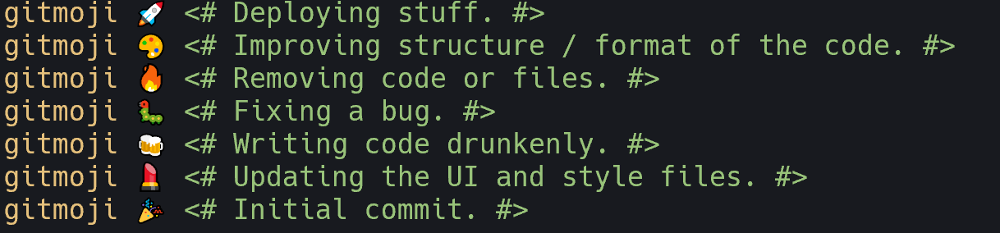

# posh-gitmoji

posh-gitmoji makes it easier to use [gitmoji](https://github.com/carloscuesta/gitmoji/) in your terminal. It work's best with the [Windows Terminal](https://github.com/microsoft/terminal) for it's emoji support so you can see the emojis rendered before you make your commits.



# Installation

```powershell
Install-Module posh-gitmoji
```

Now you can type `gitmoji <tab>` and `<tab>` to autocomplete any gitmoji
